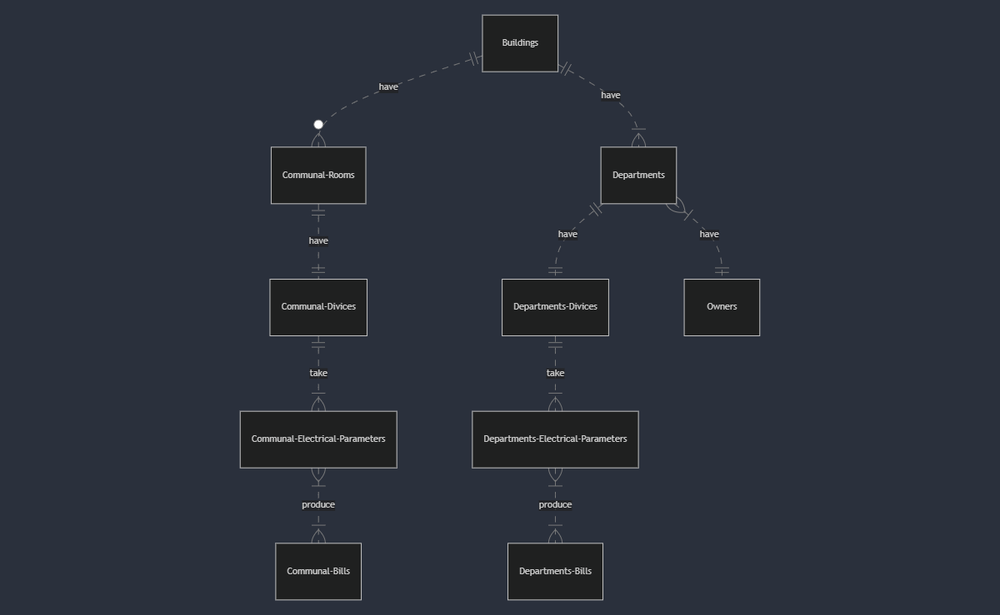

# Design Document

By Bernardo Antonio Dávila Rondón

Video overview: <URL HERE>

## Scope

The purpose of my database is to store the electrical energy consumption of each communal room (if it exists) and each apartment in different residential buildings. So that individual invoices can be generated from the monthly record.

* Residential buildings, including their address, the name of the company managing them, the number of communal rooms and apartments they contain.
* The owners of the apartments and their basic contact information, to whom a monthly bill for electricity consumption will be assigned.
* The electrical energy measurement devices, both in the common rooms and in the apartments of each building, which individually record electricity consumption values and various electrical parameters.
* The electricity consumption bills for each common room and each apartment in the building.

The database does not include data related to monetary charges associated with electricity consumption, which is recorded individually. The billing tables will only include electrical parameters.

## Functional Requirements

* The user will have the ability to create new buildings with different common rooms and/or apartments.
* The user will have the ability to check the electricity consumption of each common room or apartment individually.
* The user will have the ability to update the basic information of apartment owners in case of an ownership change.
* The user will be able to delete communal rooms that are decommissioned, for example.

Out of the scope we have that the monthly invoice tables include data on electricity consumption and not other parameters described in the electrical parameter tables.

## Representation

### Entities

Below is an explanation of the database entities, their attributes, types, and constraints:

Note: all columns in every table have the `NOT NULL` constraint applied, except for columns with `PRIMARY KEY` or `FOREIGN KEY`. It is necessary for all data to have a value to ensure data integrity and consistency, preventing null values that could lead to errors or incomplete records.

#### Buildings

The `buildings` table includes:

* `id`, which specifies the unique ID for the building as an `INTEGER` type. This column has the constraint `PRIMARY KEY` applied.
* `name`, which specifies the name of each building and is of type `TEXT`.
* `address`, which specifies the address of each building and is of type `TEXT`. The `UNIQUE` constraint is applied because there can't be more than one building at the same address.
* `administrated_by`, which specifies the name of enterprise which administers the building and is of type `TEXT`.
* `communal_rooms_amount`, which is the amount of communal rooms in the building and is of type `INTEGER`.
* `departments_amount`, which is the amount of departments in the building and is of type `INTEGER`.

#### Communal rooms

The `communal_rooms` table includes:

* `id`, which specifies the unique ID for the communal room as an `INTEGER` type. This column has the constraint `PRIMARY KEY` applied.
* `name`, which specifies the name of the communal room in the building and is of type `TEXT`.
* `building_id`, which is the ID of the building  where the communal room is located, is of type `INTEGER` and has the `FOREIGN KEY` constraint applied.

#### Owners

The `owners` table includes:

* `id`, which specifies the unique ID for each department owner as an `INTEGER` type. This column has the constraint `PRIMARY KEY` applied.
* `first_name`, which specifies the first name of the communal room in the building and is of type `TEXT`.
* `last_name`, which specifies the last_name of the communal room in the building and is of type `TEXT`.
* `email`, which specifies the email address of each owner and is of type `TEXT`. The `UNIQUE` constraint is applied to ensure no two owners have the same email address.
* `phone_number`, which specifies the phone number of each owner and is of type `TEXT`. The `UNIQUE` constraint is applied to ensure no two owners have the same phone number.

#### Departments

The `departments` table includes:

* `id`, which specifies the unique ID for each department as an `INTEGER` type. This column has the constraint `PRIMARY KEY` applied.
* `department_number`, which specifies the number of each department in the building where belongs to and is of type `TEXT`.
* `owner_id`, which is the ID of the department's owner, is of type `INTEGER` and has the `FOREIGN KEY` constraint applied.
* `building_id`, which is the ID of the building where belongs to, is of type `INTEGER` and has the `FOREIGN KEY` constraint applied.

#### Communal divices

The `communal_divices` table includes:

* `id`, which specifies the unique ID for each divice as an `INTEGER` type. This column has the constraint `PRIMARY KEY` applied.
* `type`, which specifies the type of divice and is of type `TEXT`. This column has the constraint `CHECK` to ensure it only contains one of the three allowed types of divices for this application.
* `serial_number`, which is the serial number of each divice, is of type `TEXT` and has the `UNIQUE` constraint applied to ensure a divice is not duplicated.
* `room_id`, which is the ID of the room where the divice belongs to, is of type `INTEGER` and has the `FOREIGN KEY` constraint applied.
* `building_id`, which is the ID of the building where the communal room belongs to, is of type `INTEGER` and has the `FOREIGN KEY` constraint applied.

#### Departments divices

The `departments_divices` table includes:

* `id`, which specifies the unique ID for each divice as an `INTEGER` type. This column has the constraint `PRIMARY KEY` applied.
* `type`, which specifies the type of divice and is of type `TEXT`. This column has the constraint `CHECK` to ensure it only contains one of the three allowed types of divices for this application.
* `serial_number`, which is the serial number of each divice, is of type `TEXT` and has the `UNIQUE` constraint applied to ensure a divice is not duplicated.
* `department_id`, which is the ID of the department where the divice belongs to, is of type `INTEGER` and has the `FOREIGN KEY` constraint applied.
* `building_id`, which is the ID of the building where the department belongs to, is of type `INTEGER` and has the `FOREIGN KEY` constraint applied.

#### Communal electrical parameters

The `communal_electrical_parameters` table includes:

* `id`, which specifies the unique ID for the electrical parameters of each divice as an `INTEGER` type. This column has the constraint `PRIMARY KEY` applied.
* `divice_id`, which is the ID of the divice from where the electrical parameters are been taken, is of type `INTEGER` and has the `FOREIGN KEY` constraint applied.
* `energy_consumption`, which specifies the electrical energy consumption registered by a divice, is the type `REAL`.
* `voltage`, which specifies the voltage registered by a divice, is the type `REAL`.
* `current`, which specifies the current registered by a divice, is the type `REAL`.
* `frecuency`, which specifies the frecuency registered by a divice, is the type `REAL`.
* `power`, which specifies the power registered by a divice, is the type `REAL`.
* `timestamp`, which is the time and date where the registers of the electrical parameters are been taken, is the type `TEXT` as ISO8601 strings ("YYYY-MM-DD HH:SS.SSS").

#### Departments electrical parameters

The `departments_electrical_parameters` table includes:

* `id`, which specifies the unique ID for the electrical parameters of each divice as an `INTEGER` type. This column has the constraint `PRIMARY KEY` applied.
* `divice_id`, which is the ID of the divice from where the electrical parameters are been taken, is of type `INTEGER` and has the `FOREIGN KEY` constraint applied.
* `energy_consumption`, which specifies the electrical energy consumption registered by a divice, is the type `REAL`.
* `voltage`, which specifies the voltage registered by a divice, is the type `REAL`.
* `current`, which specifies the current registered by a divice, is the type `REAL`.
* `frecuency`, which specifies the frecuency registered by a divice, is the type `REAL`.
* `power`, which specifies the power registered by a divice, is the type `REAL`.
* `timestamp`, which is the time and date where the registers of the electrical parameters are been taken, is the type `TEXT` as ISO8601 strings ("YYYY-MM-DD HH:SS.SSS").

#### Communal bills

The `communal_bills` table includes:

* `id`, which specifies the unique ID for each bill as an `INTEGER` type. This column has the constraint `PRIMARY KEY` applied.
* `communal_room_divice_id`, which is the ID of the divice from where the electrical parameters are been taken, is of type `INTEGER` and has the `FOREIGN KEY` constraint applied.
* `month`, which specifies the month to which the bill corresponds, is of type `TEXT`.
* `year`, which specifies the year to which the bill corresponds, is of type `TEXT`.
* `month_energy_consumption`, which specifies the amount of energy consumed during the month, is of type `REAL`.
* `total_energy_consumption`, which specifies the total amount of energy consumed, is of type `REAL`.

#### Departments bills

The `departments_bills` table includes:

* `id`, which specifies the unique ID for each bill as an `INTEGER` type. This column has the constraint `PRIMARY KEY` applied.
* `deparment_divice_id`, which is the ID of the divice from where the electrical parameters are been taken, is of type `INTEGER` and has the `FOREIGN KEY` constraint applied.
* `month`, which specifies the month to which the bill corresponds, is of type `TEXT`.
* `year`, which specifies the year to which the bill corresponds, is of type `TEXT`.
* `month_energy_consumption`, which specifies the amount of energy consumed during the month, is of type `REAL`.
* `total_energy_consumption`, which specifies the total amount of energy consumed, is of type `REAL`.

### Relationships

The below entity relationship diagram describes the relationships among the entities in the database.

As detailed by the diagram:

* A building can have zero or multiple communal rooms and must have at least one apartment. On the other hand, communal rooms and apartments belong exclusively to one building.
* Communal rooms (if they exist) must have a measuring device, and the device, in turn, corresponds exclusively to a communal room.
* The apartments must have a measuring device, and the device, in turn, corresponds exclusively to a single apartment. Additionally, each apartment must have only one owner, but an owner can have one or more apartments.
* The measuring devices, whether for the apartments or the communal rooms, will record one or more measurements of electrical parameters. On the other hand, the electrical parameters are exclusively recorded by a single measuring device.
* With the stored electrical parameters, one or more bills can be generated in both cases (apartments and communal rooms).
* In both cases bills can be generated from one or several electrical parameters.

## Optimizations

I created a VIEW to search for bills using the owner's name. This VIEW is designed to optimize searches, as performing this query requires joining five tables from the database. By using the VIEW, this type of search is executed more quickly.

## Limitations

* Adding new device types requires altering the schema, which is not flexible.
* Bills only track total consumption for a room or department but lack details like tariffs, payment status, or due dates.